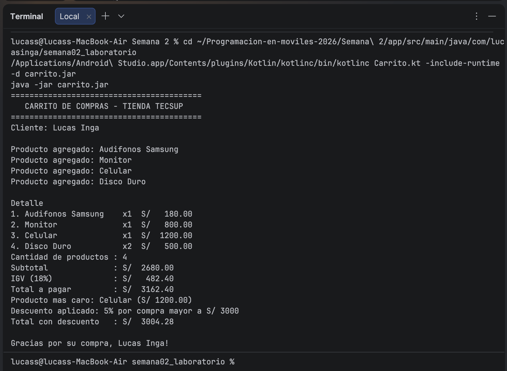

# Laboratorio 02 - Carrito de Compras en Kotlin

**Alumno:** Lucas Inga  
**Curso:** Programación en Móviles - 4to Ciclo  
**Institución:** Tecsup 2026

## Descripción

Programa de consola en Kotlin que simula un carrito de compras para la Tienda Tecsup.
Implementa programación orientada a objetos con los siguientes conceptos:

- **Abstracción:** clase abstracta `ProductoBase` e interfaz `Reportable`
- **Herencia:** `ProductoElectronico` y `ProductoAccesorio` heredan de `ProductoBase`
- **Polimorfismo:** cada subclase sobreescribe el método `categoria()`
- **Encapsulamiento:** `CarritoDeCompras` protege la lista con atributos privados

## Captura de la consola

## val vs var

`val` declara una variable inmutable (no puede cambiar después de asignarse).
`var` declara una variable mutable (puede cambiar su valor).

En `ProductoBase`, `nombre` y `precio` son `val` porque los datos
de un producto no deben modificarse una vez creado. `cantidad` es `var` porque
puede cambiar dentro del carrito.

## Prompt utilizado

"Tengo un carrito de compras en Kotlin con una data class Producto. 
Necesito refactorizarlo aplicando OOP: abstracción con clase abstracta, 
herencia con subclases ProductoElectronico y ProductoAccesorio, 
encapsulamiento con clase CarritoDeCompras de lista privada, 
y abstracción con interfaz Reportable implementada por Tienda."