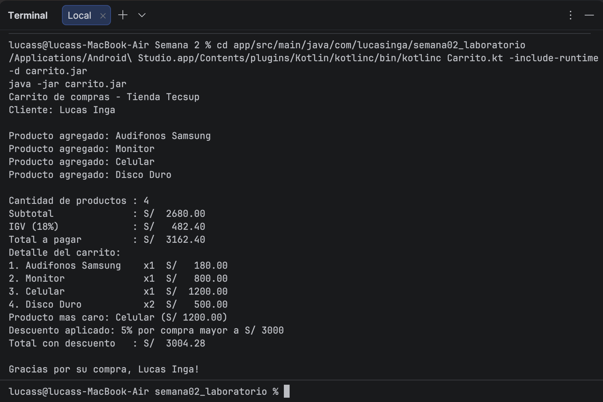

# Laboratorio 02 - Carrito de Compras en Kotlin

**Alumno:** Lucas Inga  
**Curso:** Programación en Móviles - 4to Ciclo  
**Institución:** Tecsup 2026

## Descripción

Programa de consola en Kotlin que simula un carrito de compras para la Tienda Tecsup.
Implementa las siguientes funciones:

- `calcularSubtotal`: suma el precio por cantidad de cada producto
- `calcularIGV`: calcula el 18% del subtotal
- `calcularTotal`: suma subtotal e IGV
- `mostrarDetalle`: imprime el detalle del carrito con columnas alineadas
- `calcularDescuento`: aplica 5% si el total supera S/ 3000, o 10% si supera S/ 5000

## Captura de la consola

## val vs var

`val` declara una variable inmutable (no puede cambiar después de asignarse).
`var` declara una variable mutable (puede cambiar su valor).

En la `data class Producto`, `nombre` y `precio` son `val` porque los datos
de un producto no deben modificarse una vez creado. `cantidad` es `var` porque
puede cambiar dentro del carrito (por ejemplo, agregar más unidades).

Si intentas cambiar el precio después de crear el producto, el compilador
lanza un error: `Val cannot be reassigned`.